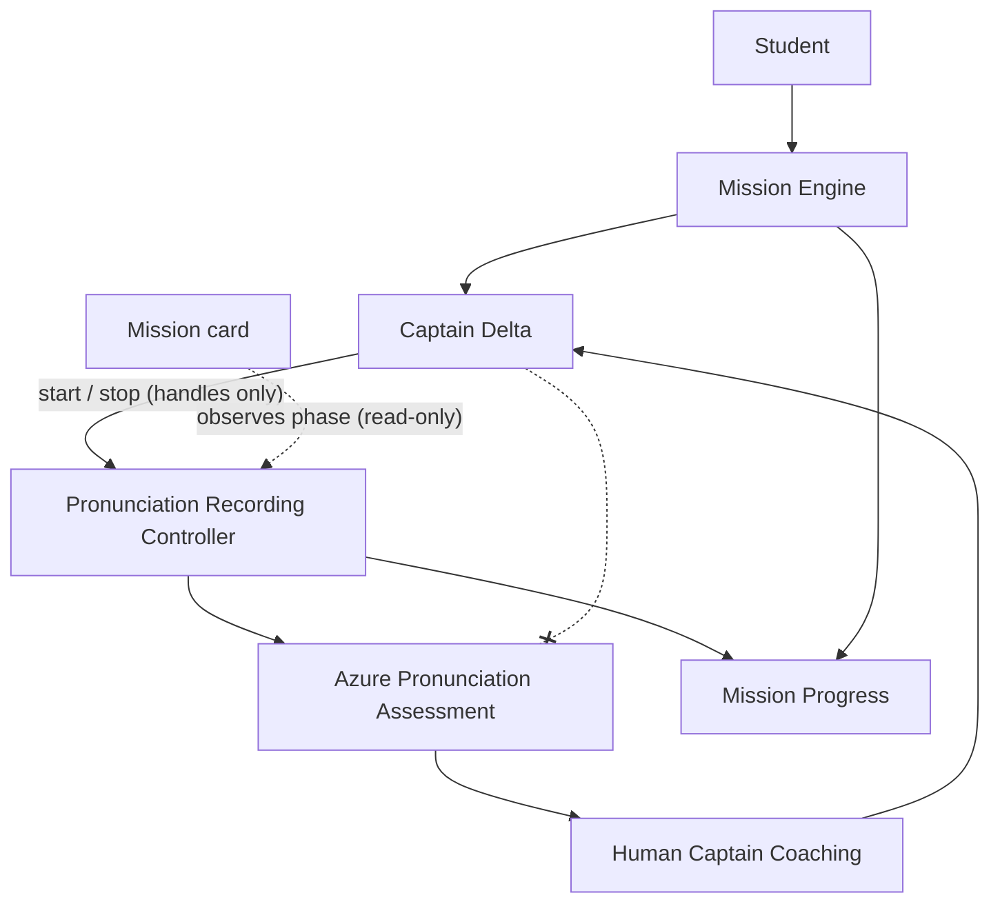

# 02 — Architecture

## Purpose

This chapter defines **how the ICAO Delta system is structured** — boundaries, ownership, and data flow. It describes enduring design, not temporary implementation details.

---

## Product flow (pronunciation leg)



**Ownership:**

- **Captain Delta** calls controller handles — does **not** import or own Azure.
- **Mission card** observes recording state — does **not** duplicate the Record button.
- **Recording controller** owns the state machine, Azure I/O, and side effects (vault, progress).

---

## Stack

| Layer | Technology |
|-------|------------|
| Framework | Next.js (App Router) |
| UI | React, client components for interactive training |
| Auth | Session cookies |
| Database | PostgreSQL via Prisma |
| AI | OpenAI API for evaluation and Captain Q&A |
| Speech | Azure Cognitive Services (STT, pronunciation assessment, TTS) |
| Deploy | Vercel |

Application code: `app/`, `components/`, `lib/`, `hooks/`. AI prompt text: [prompts/](./prompts/).

---

## System layers

```
Presentation     app/* · components/* · MissionFocusLayout
       ↓
Application      hooks — thin adapters to domain logic
       ↓
Domain (lib/)    dailyMission · vault · captainDelta · azure · pronunciation
       ↓
Infrastructure   localStorage · window events · Prisma API · Azure SDK
```

**Dependency rule:** `app → components → hooks → lib`. Domain code never imports UI.

---

## Bounded contexts

Each context has **one owner**. Cross-context writes are forbidden unless explicitly designed.

| Context | Owns | Never owns |
|---------|------|------------|
| **Mission Engine** | Leg order, completion, next action, daily rotation | Coaching copy, recording |
| **Learning Runtime** | Session UX inside a leg, calls controllers | Mission completion |
| **Recording** | Mic lifecycle, assessment I/O, reference text | Coaching delivery |
| **Captain Delta** | Teaching copy, TTS/PTT, guidance (read-only mission view) | Recording state, vault writes, leg advancement |
| **Memory** | Longitudinal patterns, instructor session history | Mission state |
| **Sync** | Server reconciliation, autosave | Business rules |
| **Knowledge** | Curated operational content (future KDB) | AI invention |

**Critical rules (ADR-008, ADR-009):**

- Mission Engine decides; Captain coaches.
- Captain never writes vault, study-time, or mission completion.
- Recording controller never marks a leg complete.

---

## Mission pipeline

```
Daily exam rotation (23C→26C)
  → Mission Engine selects today's legs
  → Student enters mission-focus route
  → Leg completes → Engine persists → next leg CTA
  → Flight Debrief closes session
```

Mission-focus routes share one layout. The engine is the single authority for *what comes next*.

---

## Captain pipeline

```
Triggers (route entry, assessment, PTT, mission events)
  → Processing layer (briefing, pronunciationCoach, messageDedup, memory)
  → CaptainDeltaProvider (deliverMessage, triggerPrimaryAction)
  → UI (floating assistant, coaching card, avatar)
  → Optional TTS (speechText shorter than screen text)
```

Captain observes recording state; Captain calls controller `start/stop` — Captain does not own the reducer or Azure SDK.

---

## Recording pipeline

```
Captain mic action
  → Recording controller (state machine)
  → Azure hook (getUserMedia, Speech SDK, pronunciation assessment)
  → Assessment parse (internal scores)
  → Human feedback layer (instructor copy — no raw metrics to student)
  → Side effects (vault, study activity, mission progress) — owned by controller, not Captain
```

**Principles:** one owner, one state machine, one mic mutex, non-empty reference text before start.

Detail: [05_RECORDING.md](./05_RECORDING.md)

---

## Data flow

```
Student speaks
  → Azure STT + pronunciation assessment (where applicable)
  → Evaluation API (scores) + Flight Instructor API (structured debrief)
  → UI + Captain suggestion event
  → Captain delivers human coaching
  → Memory records session pattern
  → Mission Engine updates progress
```

**Persistence:**

| Data | Lifetime | Mechanism |
|------|----------|-----------|
| Session UI | Route | React state |
| Recording | Attempt | Reducer + Azure |
| Vault, missions, study days | Persistent | localStorage + API sync |
| Captain messages | Ephemeral | Provider state |
| Auth | Session | Cookie |

Sync: optimistic local first, debounced server merge on login. Compare before write — no-op if unchanged.

---

## Provider composition

```
AuthProvider
  └─ AppShell
       └─ CaptainDeltaProvider
            └─ ExaminerProvider (mock/simulado persona)
                 └─ Mission screens + FloatingAssistant
```

Providers compose cross-cutting concerns. Business rules stay in `lib/`.

---

## Event bus policy

Use window events only for **cross-subtree sync**: vault changes, study-time batching, Captain suggestions, mission completion notifications.

Use React context and props for same-screen concerns: active word, recording phase, lesson snapshot.

---

## API categories

| Category | Purpose |
|----------|---------|
| Auth | Register, login, logout |
| Coaching | `/api/captain-delta`, `/api/flight-instructor`, `/api/evaluate` |
| Sync | Vault, daily mission, study activity |
| Speech | Azure token, TTS proxy |

Protected routes require authenticated user. Server never trusts client scores for graduation without re-validation on merge.

---

## Design goals

- Single responsibility per module
- One writer per persisted domain
- Ref-stable callbacks; compare before setState
- Pure functions in `lib/`; hooks stay thin
- Events only where context cannot reach

---

## Related decisions

See [decisions/](./decisions/) — especially ADR-001 (Mission Engine), ADR-008 (single source of truth), ADR-009 (Captain authority).
