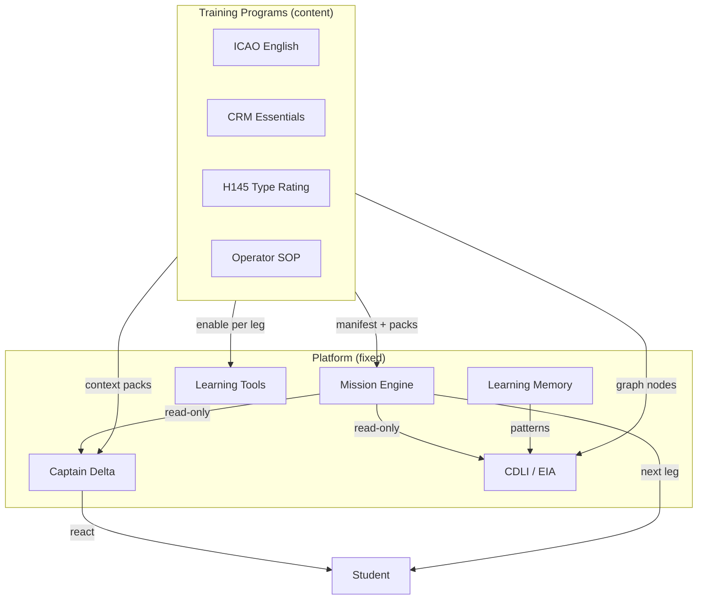

# RFC-002 — Training Programs Architecture (TPA)

| Field | Value |
|-------|-------|
| **Status** | Accepted (documentation layer) |
| **Date** | July 2026 |
| **Author** | Chief Product Architect |
| **Scope** | Product architecture — programs as content packages on a fixed platform |
| **Locks preserved** | ADR-001–012, Mission Engine, EIA/CDLI (RFC-001), Captain Authority |

---

## 1. Architectural review (critical)

### 1.1 What the proposal gets right

- **Programs as top-level abstraction** — Correct evolution from “ICAO app” to “AI Flight Training Platform.”
- **Platform unchanged, content varies** — Aligns with RFC-001 program-agnostic CDLI.
- **Program isolation rule** — Programs configure; they do not fork Mission Engine or Captain.
- **Universal lifecycle** — Enrollment → … → Recurrent is teachable and auditable.
- **Program contract** — Gives every future program a checklist without inventing code now.
- **Examples (H145, CRM, SOP)** — Grounds abstraction in real aviation training.

### 1.2 Unnecessary complexity (identified)

| Proposal element | Issue | Simplification |
|------------------|-------|----------------|
| **20-field contract as mandatory for every program** | Small programs (IFR refresher) do not need certificates, video, etc. | **Core contract** + **optional capability flags** |
| **Program-specific Mission Engines** | Violates ADR-001 | **One engine** + **program mission template** (matrix profile) |
| **Program-specific Captain Delta** | Violates Section 02 identity | **Captain persona fixed**; program supplies **context packs** only |
| **Program-specific EIA / CDLI** | Violates RFC-001 | **Same five CDLI capabilities**; program supplies graph nodes |
| **Program-specific Learning Tools** | Tool sprawl | Tools stay **orthogonal**; programs enable/disable per leg |
| **Enrollment / Certification as new platform modules now** | Implementation creep | **Lifecycle stages** documented; platform features phased |
| **10 program type categories as rigid taxonomy** | Over-classification | **Tags** + examples — programs can be multi-tagged |
| **Adaptive Learning as separate from CDLI** | Duplicate | **CDLI Assistance Calibration** + Learning Memory — not a program subsystem |

### 1.3 Conflicts with locked architecture (resolved)

| Lock | TPA rule |
|------|----------|
| Mission Engine (ADR-001–005) | Programs supply **templates** and **content IDs**; engine still owns `getNextMissionAction()` |
| Captain (ADR-009) | Programs supply briefing/debrief **context**; Captain never mutates legs |
| EIA / CDLI (RFC-001) | Programs extend **operational graph nodes**; CDLI capabilities unchanged |
| Mission Flow Matrix | Each program declares a **matrix profile** (subset/reorder of **allowed leg types**, not ad-hoc legs) |
| ADR-012 | New program **content** = documentation + data; new **leg types** = ADR-013+ |

### 1.4 Architectural validation (H145, CRM, SOP)

| Program | Platform change required? | Coupling today | Clean path |
|---------|---------------------------|----------------|------------|
| **CRM Essentials** | **No** (content) | Part 1 / debrief prompts ICAO-biased | Program manifest: scenarios + vocab + P1 topics + rubric |
| **H145 Type Rating** | **No** for v1 (content on existing legs) | Pronunciation/vocab/scenario data ICAO-centric | Program packs + mission template; systems vocab in graph |
| **Company SOP** | **No** (content + resources) | Resource philosophy already category-based | SOP pack as vocab + scenario + resource categories |
| **IFR Refresher** | **No** | Part 2 readback patterns | Scenario pack + evaluation rubric |
| **AW169 Transition** | **No** | Differences as vocab + scenarios | Same as type rating |
| **Offshore / NVG / HAA** | **No** for communication-first programs | May need specialized media later | Audio/scenario packs on Passive + Part 2 legs |
| **Simulator-integrated type rating** | **Maybe** (ADR-013+) | No sim hook today | External sim remains outside v1 platform boundary |
| **Formal certificates / LMS enrollment** | **Maybe** (ADR-013+) | Account is basic today | Lifecycle **stages** exist; LMS features optional later |

**Conclusion:** Communication-focused programs (CRM, SOP, IFR refresh, type rating **oral** track) require **no platform redesign** — only **program manifests and content packs**. Hardware/simulator integration and formal credentialing are **platform extensions**, not program forks.

### 1.5 Coupling to remove over time (implementation debt, not TPA)

| Coupling | Owner today | Program-ready direction |
|----------|-------------|-------------------------|
| Exam rotation hardcoded 23C–26C | `dailyExamRotation.ts` | Program manifest: `contentRotation` |
| Mission legs named for ICAO only | Mission chapters 04–09 | Leg **types** stable; program binds content |
| Evaluate prompts ICAO-specific | `prompts/` | Program-scoped prompt packs |
| Single implicit program | Entire codebase | `programId` on user enrollment (future ADR) |

TPA documents the target; **does not implement** `programId`.

---

## 2. Accepted changes

| # | Change |
|---|--------|
| B1 | **Training Programs** as top-level product abstraction |
| B2 | **ICAO English** = **Program 1** (`icao-english`) — not the platform |
| B3 | **Program Contract** — core fields + optional capabilities |
| B4 | **Universal program lifecycle** (10 stages) |
| B5 | **Program types** as descriptive tags, not rigid classes |
| B6 | **Program isolation** — configure platform layers, never replace them |
| B7 | `flight-manual/21-training-programs.md` — normative program chapter |
| B8 | `flight-manual/architecture/training-program-architecture.md` — integration map |
| B9 | Cross-links in README, DOCUMENTATION-HIERARCHY, CURRENT-PRODUCT, Section 18 |
| B10 | Decision 013 in DECISION-RECORDS |

---

## 3. Rejected ideas

| Idea | Reason |
|------|--------|
| Per-program Mission Engine | ADR-001 |
| Per-program Captain Delta persona | Section 02 — one instructor face |
| Per-program CDLI / EIA | RFC-001 — five capabilities are universal |
| Per-program Learning Tools fork | Tools are orthogonal by design |
| Programs defining arbitrary leg order outside matrix | Mission Flow Matrix remains canonical **leg type** order |
| Mandatory video/certificate fields for all programs | Contract overload |
| TPA as runtime `lib/programs/` module now | Documentation-only RFC |
| “Adaptive Learning” as separate platform layer | CDLI + Memory already own this |

---

## 4. Training Programs architecture (final)

### 4.1 Layer stack

```
┌─────────────────────────────────────────────────────────────┐
│  TRAINING PROGRAMS (content + configuration)                │
│  ICAO English · CRM · H145 · SOP · IFR · …                  │
├─────────────────────────────────────────────────────────────┤
│  PLATFORM (fixed)                                           │
│  Mission Engine │ Captain Delta │ EIA/CDLI │ Learning Tools │
│  Learning Memory │ Auth │ Azure │ PWA                       │
└─────────────────────────────────────────────────────────────┘
```

**Platform teaches. Programs define what is taught.**

### 4.2 Program artifact model (simplified)

A program is not code. It is a **manifest** plus **content packs**:

| Artifact | Purpose |
|----------|---------|
| **Program manifest** | Contract fields, matrix profile, enabled capabilities |
| **Content packs** | Vocab, pronunciation, scenarios, topics, media, rubrics |
| **Captain context pack** | Briefing tone hints, resource categories, debrief emphasis |
| **Graph projection** | Nodes/edges loaded into operational graph for this program |

### 4.3 Matrix profile (how programs differ in sequencing)

Programs do not invent legs. They declare a **matrix profile**:

| Profile field | Example |
|---------------|---------|
| `legs` | Subset of canonical leg types from [mission-flow-matrix.md](./mission-flow-matrix.md) |
| `modes` | Standard / Intense / Passive availability |
| `mockRequired` | true for ICAO Intense; false for CRM refresh |
| `recallRequired` | true before evaluated legs when configured |

ICAO English uses the full Standard/Intense profile shipped today. CRM might omit Mock Exam and use a shorter matrix profile — **same engine**, different template.

---

## 5. Canonical program contract

See [21-training-programs.md](../21-training-programs.md) for full spec.

**Core (required):**

- Program ID, name, purpose, audience, prerequisites
- Knowledge domains (tags)
- Mission template reference (matrix profile)
- Learning outcomes
- Completion rules

**Optional capabilities (declare only what you need):**

- Vocabulary / pronunciation / scenario packs
- Operational graph extension
- Media assets
- Evaluation rubrics
- Certificates
- Captain context pack
- Recommended resource categories

---

## 6. Lifecycle specification

Universal stages (platform orchestrates; program fills content):

```
Enrollment → Assessment → Mission Assignment → Daily Missions
  → Adaptive Learning (CDLI) → Evaluation → Debrief
  → Certification → Recurrent Training
```

| Stage | Platform | Program provides |
|-------|----------|------------------|
| Enrollment | Account, program selector | Eligibility, prerequisites |
| Assessment | Evaluate APIs, memory baseline | Rubric, placement scenarios |
| Mission Assignment | Mission Engine | Template + rotation rules |
| Daily Missions | Engine + legs | Daily content packs |
| Adaptive Learning | CDLI + Memory | Weak-area emphasis in graph |
| Evaluation | Azure + instructor JSON | Rubric weights |
| Debrief | Flight Debrief + Captain | Priority focus areas |
| Certification | (future) | Criteria, credential metadata |
| Recurrent | Engine scheduling | Refresher template |

---

## 7. Integration diagram



---

## 8. Required documentation changes

| Document | Change |
|----------|--------|
| `21-training-programs.md` | **Created** — contract, lifecycle, examples |
| `architecture/training-program-architecture.md` | **Created** — integration |
| `README.md` | Section 21 + TPA index |
| `DOCUMENTATION-HIERARCHY.md` | Programs layer in hierarchy |
| `CURRENT-PRODUCT.md` | Program 1 only shipped; platform framing |
| `18-product-roadmap.md` | Era 5–6 reframed as programs on platform |
| `TERMINOLOGY.md` | Training Program, Program 1 |
| `DECISION-RECORDS.md` | Decision 013 |

**Not rewritten:** Mission Engine chapter, ADRs, EIA folder, mission chapters 04–10.

---

## 9. Future implementation guidance

### 9.1 When implementation begins (requires ADR-013+)

| Change | Why ADR |
|--------|---------|
| `programId` on user / enrollment | New state dimension |
| `dailyMission.ts` reads program manifest | Engine extension, not fork |
| Program selector in onboarding | Student-visible behavior |
| New leg **types** (e.g. cockpit drill) | Matrix amendment |

### 9.2 Safe without ADR (content-only)

- New scenario JSON packs under program namespace
- New vocabulary lists
- Program-specific prompt files
- Documentation and IMPLEMENTATION-STATUS rows

### 9.3 PR checklist for program content

- [ ] Manifest documents matrix profile
- [ ] No fork of `dailyMission.ts`
- [ ] Captain context read-only
- [ ] CDLI capability cited (from RFC-001)
- [ ] Learning tools referenced, not duplicated

---

## Approval

| Role | Decision | Date |
|------|----------|------|
| Chief Product Architect | Accept RFC-002 (documentation) | July 2026 |
| Mission Engine / EIA / CDLI locks | Unchanged | July 2026 |

**Primary reference:** [21-training-programs.md](../21-training-programs.md)
