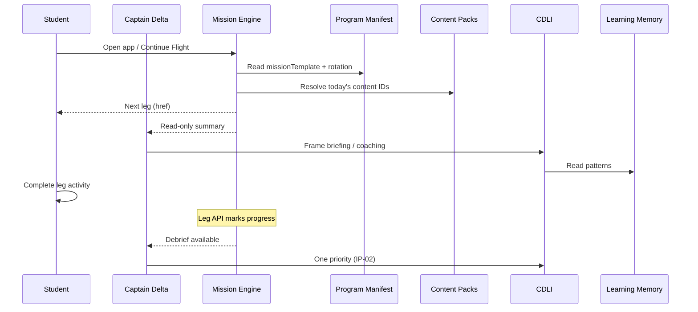

# Training Program Architecture (TPA)

**How Training Programs sit on the ICAO Delta platform.**

Normative program spec: [21-training-programs.md](../21-training-programs.md)  
Acceptance record: [RFC-002](./rfc/RFC-002-training-programs-architecture.md)

**Locks:** Mission Engine (ADR-001–005) · Captain (ADR-009) · EIA/CDLI (RFC-001)

---

## Platform vs programs

| Layer | Question | Mutable by programs? |
|-------|----------|----------------------|
| **Training Programs** | What is taught? | Yes — content + manifest |
| **Mission Engine** | What leg is next? | **No** — configure template only |
| **Captain Delta** | What does student see/hear? | **No** — context packs only |
| **EIA / CDLI** | How does Captain teach? | **No** — graph nodes only |
| **Learning Tools** | In-leg mechanics? | **No** — enable/disable per leg |
| **Learning Memory** | What is remembered? | Scoped by program (future) |

```
                    ┌──────────────────────────────┐
                    │     Training Programs        │
                    │  (manifests + content packs) │
                    └──────────────┬───────────────┘
                                   │ configures
         ┌─────────────────────────┼─────────────────────────┐
         ▼                         ▼                         ▼
┌─────────────────┐    ┌─────────────────┐    ┌─────────────────┐
│ Mission Engine  │    │ Captain Delta   │    │ EIA / CDLI      │
│ WHAT            │    │ WHO (student    │    │ HOW             │
│                 │    │  talks to)      │    │                 │
└────────┬────────┘    └────────┬────────┘    └────────┬────────┘
         │ read-only              │ read-only              │
         └────────────────────────┼────────────────────────┘
                                  ▼
                    ┌──────────────────────────────┐
                    │      Learning Tools          │
                    │  (inside legs — orthogonal)  │
                    └──────────────────────────────┘
```

---

## Mission Engine integration

### Today (Program 1 implicit)

- `lib/dailyMission.ts` orchestrates ICAO English legs
- Exam rotation: 23C → 24C → 25C → 26C
- Intense mode adds Mock Exam per matrix

### Target (multi-program)

Mission Engine gains a **program context** (future ADR-013+):

```
getDailyMissionSummary(programId)
getNextMissionAction(programId)
```

Engine algorithm **unchanged**. Inputs change:

| Input | Source |
|-------|--------|
| Active `programId` | User enrollment |
| `missionTemplate` | Program manifest |
| Daily content IDs | Program content packs + rotation rules |
| Completion rules | Program manifest |

Programs **never** ship alternate `dailyMission.ts` files.

### Matrix profile

Each program manifest includes a **matrix profile** — a declarative subset of [mission-flow-matrix.md](./mission-flow-matrix.md):

```yaml
# Illustrative — not implemented
programId: crm-essentials
missionTemplate:
  legs: [vocabulary, part1, part2, mission_recall, flight_debrief]
  modes: [standard]
  mockExam: false
  recallBeforeEval: true
```

New leg **types** (e.g. cockpit flow drill) require matrix + ADR amendment — not a program-side hack.

---

## Captain Delta integration

Captain remains **one instructor** for all programs.

| Program supplies | Captain uses |
|------------------|--------------|
| Briefing emphasis | `buildTodayBriefing()` inputs |
| Domain vocabulary in copy | Instructor Voice capability |
| Resource categories | Debrief footnotes |
| Examiner rubric tone (ICAO) | Examiner persona in Mock |

| Program cannot | Reason |
|----------------|--------|
| Skip legs via Captain | ADR-009 |
| Mark tasks complete | Leg APIs only |
| Change study mode | UI / engine only |

---

## Educational Intelligence integration

CDLI capabilities ([RFC-001](../educational-systems/captain-delta-learning-intelligence.md)) are **program-agnostic**.

| CDLI capability | Program extends via |
|-----------------|---------------------|
| Instructional Judgment | Evaluation rubric in manifest |
| Assistance Calibration | Same PA ladder — program sets gates |
| Operational Context | Graph nodes + edges from program packs |
| Instructor Voice | Captain context pack |
| Memory Synthesis | Program-scoped memory keys (future) |

Operational graph: [operational-knowledge-graph.md](../educational-systems/operational-knowledge-graph.md) — programs add nodes; graph remains one model.

---

## Learning Tools integration

Tools are **orthogonal** — they run inside legs, not as program-specific forks.

| Tool | Program configuration |
|------|----------------------|
| Progressive Assistance | Always available — content from program packs |
| Confidence Gates | `enabledTools: [confidence_gates]` on leg |
| Mission Timeline | Shows legs from matrix profile |
| Quick Notes | Enable for Part 2-heavy programs (IFR, type rating) |
| Replay Debrief | Enable for evaluated programs |
| Passive Flight Training | Enable for offshore / listen-first programs |
| Situation Board | Post-mission synthesis — CRM, type rating |

Program manifest lists `enabledTools` per leg type. Tool specs remain in `learning-tools/`.

---

## Learning Memory integration

| Today | Target |
|-------|--------|
| Single implicit program | Memory records include `programId` |
| Captain memory global | Weak areas scoped per program |
| Cross-program insight | Optional — only if product approves via ADR |

Section 13 philosophy unchanged: store only what improves learning.

---

## Content pack layout (target)

Illustrative repository shape — **not implemented**:

```
programs/
├── icao-english/
│   manifest.yaml
│   vocab/
│   scenarios/
│   part1/
│   prompts/
├── crm-essentials/
│   manifest.yaml
│   scenarios/
│   vocab/
└── h145-type-rating/
    manifest.yaml
    vocab/
    scenarios/
```

Mission chapters (04–10) remain **leg type specifications**. Program packs **populate** those legs.

---

## Integration diagram (data flow)



---

## Architectural validation summary

| Program type | Platform redesign? | Notes |
|--------------|-------------------|-------|
| CRM | No | Scenarios + discussion on existing legs |
| H145 type (oral) | No | Vocab + emergency scenarios |
| Company SOP | No | Vocab + resources + rubric |
| IFR refresher | No | Readback-heavy Part 2 |
| Offshore / NVG / HAA | No | Passive + operational scenarios |
| Simulator-linked type rating | Maybe | External system — ADR boundary |
| Formal LMS / certificates | Maybe | New platform features — not program fork |

---

## Related

- [mission-flow-matrix.md](./mission-flow-matrix.md)
- [runtime-map.md](./runtime-map.md) — current code (Program 1 only)
- [ARCHITECTURE-LOCK.md](./ARCHITECTURE-LOCK.md)
- [educational-systems/README.md](../educational-systems/README.md)
